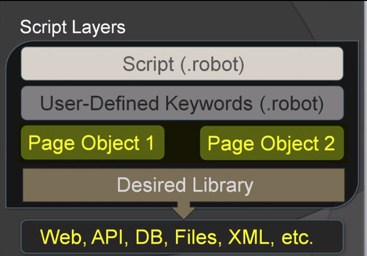

## Projeto de Automação do Site automationpractice
---
#### Site URL
      http://automationpractice.com/

#### Framework utilizado para automação dos tests
      https://robotframework.org/

---
## Arquitetura do Framework
**Script Layers**

Para este projeto utilizamos uma abordagem que nos garante a reutilização de keywords com base em uma arquitetura de tests em camadas

Iniciando do top da arquitetura nós temos as seguintes camadas:

- **Tests** (/tests) → Nesta camada estão nossos tests cases onde automatizamos os comportamentos da nossa aplicação (features) utilizando as keywords definidas em nosso framework.
  
- **User-Defined Keywords** (/resources/keywords) → Nesta camada  estão as keywords que definem o nosso framework e são baseadas nas keywords da camada de Page Objects. Aqui temos as keywords representando o fluxo da nossa aplicação.
  
- **PO (Page Object)** (/resources/pages) → Está camada é contruida pela união das keywords nativas do robot framework e as external/internal libraries. Será nesta camada que ocorerá a interação com os elementos da interface da aplicação. Toda a lógica do framework seja contida nesta camada, aqui teremos a declaração de variáveis/locators e as keywords que iteragem direto com a UI.

##### Imagem da Arquitetura do Framework

---

## Comando para executar os tests

Windows

      robot -d  ./reports --loglevel TRACE --pythonpath ./resources .\tests\

Linux

      robot -d  reports --loglevel TRACE --pythonpath ./resources tests/